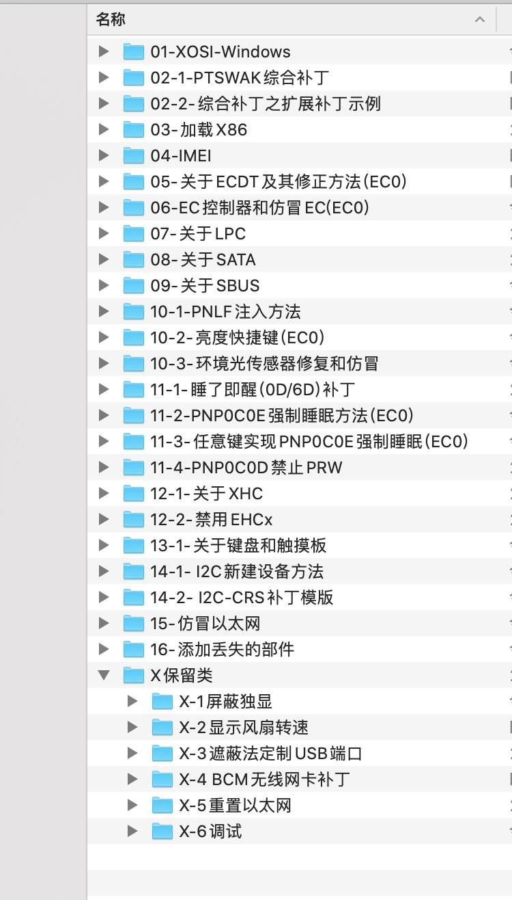

# P-little

> hackintosh hotpatch
>
> Start Date: 1-9-2019
>
> Update Date: 6-28-2019
>
> Project maintenance: 宪武 黑果小兵

# 部件补丁清单

# P-little部件补丁更名说明：

## 一、基本更名

- 为了和MAC系统设备名称相同，也为了方便制作部件补丁，规范下列设备名称。
- 基本更名是全局更名，包括_DSM方法更名。

1. LPC--------->LPCB
2. EC---------->EC0
3. XHC--------->XHC
4. EHC1-------->EH01
5. EHC2-------->EH02
6. 键盘--------->PS2K
7. SBUS设备---->SBUS
8. 盖子--------->LID0
9. 电源按键------>PWRB
10. 睡眠按键----->SLPB

### 明细如下

| 序号 | 重命名 | 说明 |
|:----:| ------ | ---- |
|01|_DSM to XDSM|其他补丁要求|
|02|LPC to LPCB|LPC设备更名要求。查询"0x001F0000"所属设备名称 1:设备名称已经是LPCB的，无需此更名 2:出现多个"0x001F0000"时，仔细判断是否需要此更名 3:如果ACPI包涵ECDT.aml，参见《关于ECDT及其修正方法》|
|03|EC to EC0|大部分机器EC更名要求，查询"PNP0C09"所属设备名称 1:设备名称已经是EC0的，无需此更名 2:出现多个"0PNP0C09"时，确认真实EC名称 3:如果ACPI包涵ECDT.aml，参见《关于ECDT及其修正方法》|
|04|H_EC to EC0|同上|
|05|ECDV to EC0(dell)|同上|
|06|EHC1 to EH01|遮蔽法更名要求。有USB2.0的机器，查询"0x001**D**0000"所属设备名称|
|07|EHC2 to EH02|遮蔽法更名要求。有USB2.0的机器，查询"0x001**A**0000"所属设备名称|
|08|XHCI to XHC|遮蔽法更名要求。查询"0x001**4**0000"所属设备名称 设备名称已经是XHC的，无需此更名|
|09|XHC1 to XHC|同上|
|10|KBD to PS2K|键盘更名要求，查询"PNP0303"、"PNP030B"、"PNP0320"所属设备名称 如果DSDT中无法确定键盘名称，通过win10查看键盘的“BIOS名称” 键盘名称已经是PS2K的，无需此更名|
|11|KBC0 to PS2K|同上|
|12|KBD0 to PS2K|同上|
|13|SMBU to SBUS||多数TP机器SBUS设备更名要求 6代之前机器，查询"0x001F0003"所属设备名称 6代及以后机器，查询"0x001F0004"所属设备名称 设备名称已经是SBUS的，无需此更名|
|14|LID to LID0|部分机器'盖子'更名要求，查询"PNP0C0D"所属设备名称 '盖子'名称已经是LID0的，无需此更名|
|15|PBTN to PWRB(dell)|部分机器'电源按键'更名要求，查询"PNP0C0**C**"所属设备名称 '电源按键'名称已经是PWRB的，无需此更名|
|16|SBTN to SLPB(dell)|部分机器'睡眠按键'更名要求，查询"PNP0C0**E**"所属设备名称 '睡眠按键'名称已经是SLPB的，无需此更名|

## 二、部件补丁更名

- 所谓P-部件补丁，就是Properties方法加部件补丁。
- Properties方法主要面向具有有效ACPI路径(_ADR)的PCI设备或者它的子设备。这些设备有显卡、声卡、IMEI、LPC、SATA等等。
- 尽可能采用Properties方法对PCI设备补丁。当Properties方法不奏效时或者其他原因时，采用对设备或者方法更名以及HOTpatch文件对其实施定制补丁。这种补丁称为部件补丁。
- 有关Properties方法，参见：
  1. 《Properties方法综述》、
  2. 《Properties-显卡补丁一览表》
  3. 《Properties-PCI设备补丁一览表》
- **每个部件补丁内有相关说明和更名文件。**

## 三、TgtBridge恢复更名

- 因clover的错误而致TgtBridge方法对DSDT以外的ACPI产生更名错误，需对这种错误更正。
- 详见《TgtBridge问题阐述@米Pro-@Steve编制》。
- 如果《TgtBridge恢复更名》未包括你的TgtBridge设备更名，请自行添加更名。

## 四、更名顺序要求

1. 基本更名
2. 部件补丁更名、电池补丁更名
3. TgtBridge恢复更名

## 五、关于睡眠

1. 正确设置 BIOS。
2. 屏蔽独显。
3. 选择合适的机型和 AAPL,ig-platform-id
4. 加载 X86 或者 XCPM。
5. EC 控制器名称为 EC。
6. 打 0D/6D 补丁。
7. CPU 变频正常。
8. 六代以前机器加载 LPC。
9. 定制 USB 端口。
10. 亮度正常。

## 六、 更新日志

### 6-28-2019

#### 本次更新主要内容

- 一、将 EC 拆分为 2 部分：

  1. 原始 ACPI 的 EC 控制器名称规范为 EC0
  2. 加入 EC 仿冒补丁。

- 二、仿冒的设备或者可能和Windows不一致的部件补丁增加系统判断语句，在 Windows 下恢复原始内容。

- 三、统一下列部件名称：

  1. "PNP0C0D" 部件：LID0（之前是 LID）
  2. "PNP0C0C" 部件：PWRB
  3. "PNP0C0E" 部件：SLPB

四、因以上变更对部件补丁和电池补丁进行修正。

五、其他更新
