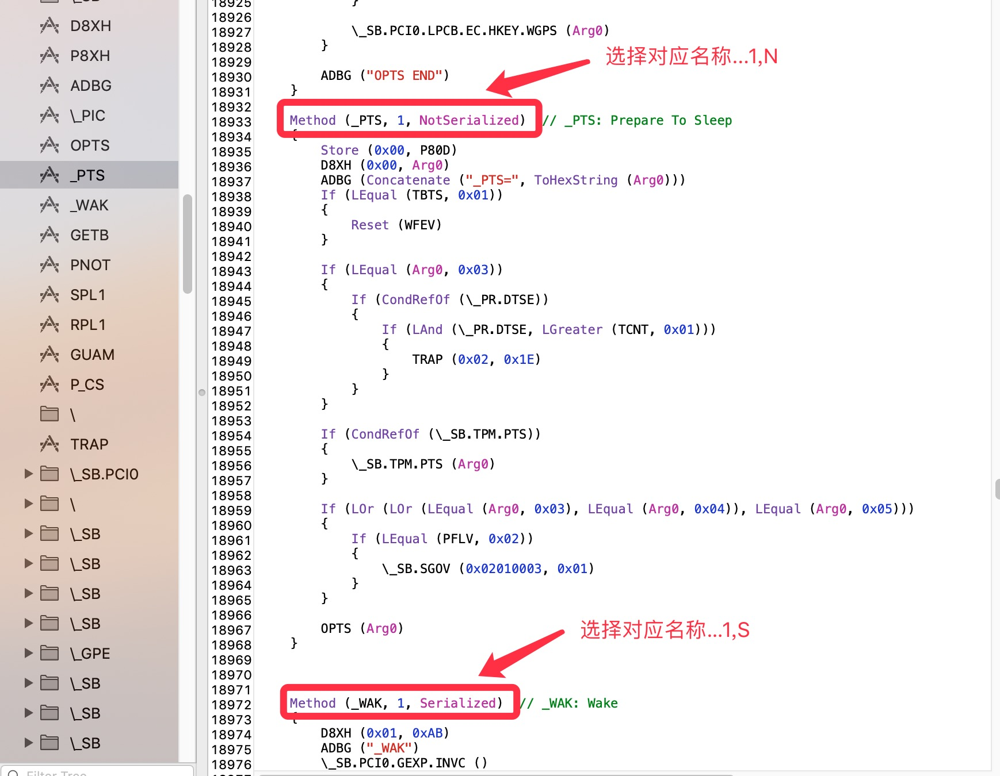

一、说明
本补丁适应于`ThinkPad`/`DELL`/`Lenovo`机器。

本补丁：

1 提供Basic方法屏蔽独显的接口，见《屏蔽独显-basic-spoof-Properties》。

2 集成了关机变重启、睡眠灯呼吸、唤醒后呼吸灯未恢复等补丁。

3 集成了EXT1和EXT3扩展补丁接口，分别位于睡眠`_PTS`和唤醒`_WAK`内。
  参见：`SSDT-%EXT3-WakeScreen-dell`。

4 设定参数：MPWS，以配合《PNP0C0E强制睡眠方法》实现睡眠功能。

二、补丁：

`SSDT-%PTSWAK-merge-PRO3`

三、更名(见“基本更名.plist”)：
`_PTS to ZPTS(1,N)`或者

`_PTS to ZPTS(1,S)`

`_WAK to ZWAK(1,N)`或者

`_WAK to ZWAK(1,S)`

根据`_PTS`和`_WAK`的数据类型选择对应的更名。

如：数据类型是`Serialized`，选择对应的...,1,S)...

如：数据类型是`NotSerialized`，选择对应的...,1,N)...

四、其他设备名称要求

XHC名称：`XHC`

五、使用：

补丁里设置了3个参数：

QPTS

0:正常

1:不执行原始`_PTS`部分

QWAK

0:正常

1:不执行原始`_WAK`部分

PMEE

0:关机时禁止使用`PMEE`

1:关机时允许使用`PMEE`

